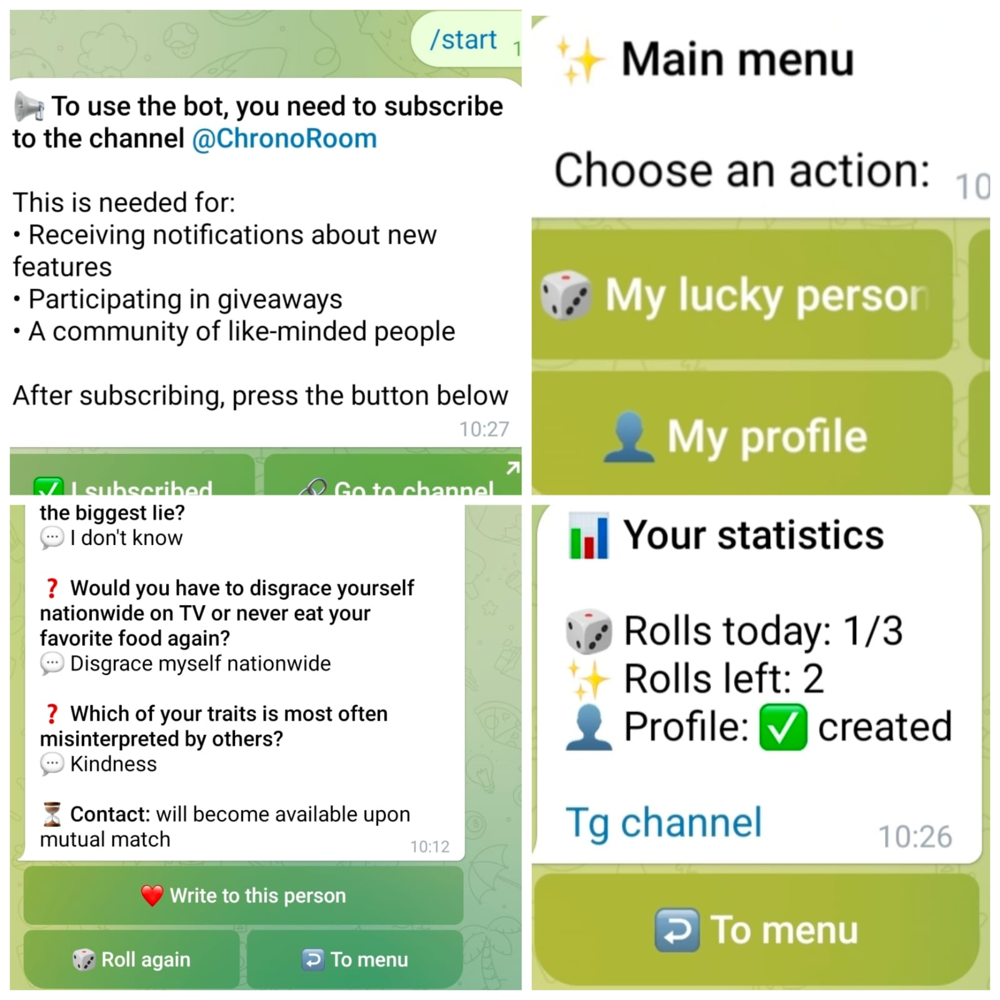

# ChronoRoom — Lucky Dice Telegram Bot

A Telegram bot for discovering random people through short profile questionnaires and a "Lucky Dice" system.

## 📸 Demo



## ✨ Features

- 🎲 Random profile discovery
- 📝 Profile creation with 5 randomly selected questions
- ❓ Question-based personal profiles
- 📸 Optional profile photo
- 🎯 Up to 3 profile discoveries per day
- 👤 Random selection of active profiles
- 💌 Anonymous messages through the bot
- 🤝 Mutual username exchange (only after both sides agree)
- 🔄 Ability to create a new profile
- 💾 SQLite database
- 🔐 Telegram channel subscription check
- 🛡 All user-supplied text is HTML-escaped before it is sent back to Telegram
- ⚡ Asynchronous architecture with Aiogram 3

## 🔄 How It Works

1. The user creates a profile by answering 5 randomly selected questions.
2. The user can optionally add a photo and chooses a name.
3. The user receives 3 "Lucky Dice" rolls per day.
4. Each roll selects a random active profile.
5. The user can send an anonymous message to the discovered person.
6. The recipient receives the sender's profile and can reply, reject the message, or propose a username exchange.
7. If both people agree, they receive each other's Telegram usernames.

## 🧩 Project Structure

```
ChronoRoom-Bot2/
├── README.md
├── .env.example
├── .gitignore
├── screenshots/
│   └── demo.jpg
├── tests/
│   ├── test_database.py
│   └── test_utils.py
├── bot.py
├── config.py
├── database.py
├── handlers.py
├── questions.py
├── requirements.txt
└── utils.py
```

| File | Purpose |
| --- | --- |
| `bot.py` | Bot entry point and polling |
| `handlers.py` | Telegram handlers and interaction logic |
| `database.py` | SQLite database and data operations |
| `questions.py` | Question pool used for profile creation |
| `utils.py` | HTML escaping, profile formatting and helpers |
| `config.py` | Bot configuration |
| `tests/` | Unit tests (standard library `unittest`) |

## 🛠 Tech Stack

- Python 3
- Aiogram 3
- SQLite
- Telegram Bot API
- asyncio

## 💾 Data Storage

The bot uses SQLite (`chronoroom_bot.db`, created on first start) to store user accounts, profiles, questionnaire answers, profile photo IDs, and daily roll counters. The database file contains personal data and is excluded from git via `.gitignore`.

## 🔒 Configuration

Credentials are read from environment variables (or from a local `.env` file). Copy the template and fill it in:

```bash
cp .env.example .env
```

| Variable | Required | Description |
| --- | --- | --- |
| `BOT_TOKEN` | yes | Bot token from [@BotFather](https://t.me/BotFather) |
| `CHANNEL_USERNAME` | no | Channel (without `@`) users must subscribe to. The bot must be an admin there. Leave empty to disable the check. |

If the subscription cannot be verified (Telegram error, misconfigured channel), the user is **not** let in and is asked to try again later.

## 🚀 Running the Bot

```bash
pip install -r requirements.txt
python bot.py
```

## ✅ Tests

```bash
python -m unittest discover -s tests -v
```

## 📌 About

ChronoRoom-Bot2 is one of several independent Telegram bots created for the ChronoRoom project.
